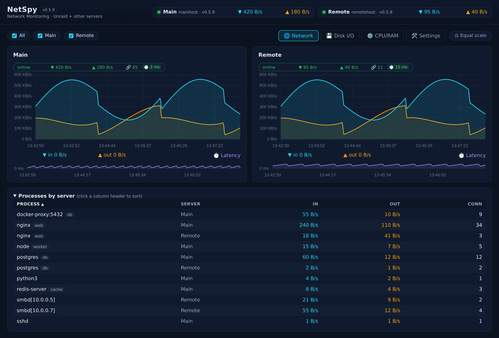

# NetSpy — Live network monitoring for Unraid + other servers

[](https://github.com/thefirstmojo/netspy/actions/workflows/publish-image.yml)

Web dashboard showing **interface and per-process network throughput** of Unraid
and other servers in real time (1 s sampling). **One image, two roles, one compose.**


*Screenshot shows synthetic demo data (two servers "Main"/"Backup") — no real hosts or containers.*

> **⚠️ Must run with `network_mode: host`** (host networking). The sampler needs
> the host's `/proc` and `ss` data to measure real host traffic — in bridge mode
> it would only see the container's own interfaces.
>
> **Runs as root** (container uid 0): host PID namespace, `/proc/<pid>` reads
> and the optional Docker socket require root — there is no non-root mode.
> For the same reason the ports are configured via `WEB_PORT`/`AGENT_PORT` (the value IS the
> host port; a `8090:8090` mapping is ignored with host networking).

| Role | Purpose | Where |
|---|---|---|
| `ROLE=web` | Web UI (:8090) + local sampler + agent API (:8091) | Unraid |
| `ROLE=agent` | Sampler + agent API only (:8091) | TrueNAS |

## Architecture

```
Unraid 10.10.10.10                        TrueNAS 10.10.10.20
┌──────────────────────────────┐        ┌─────────────────────────┐
│ netspy (ROLE=web)            │        │ netspy (ROLE=agent)     │
│  :8090 Web UI                │◄──────►│  :8091 /api/metrics      │
│  :8091 /api/metrics          │  HTTP  │  /proc + ss (inet_diag)  │
│  /proc + ss (inet_diag)      │        └─────────────────────────┘
└──────────────────────────────┘
```

Everything is driven by **one `docker-compose.yml`** — all configuration lives
directly in the file, **no `.env` file required**. `ROLE` decides what the
container does, `SERVERS` tells the dashboard where the connections go. Copy
the compose to each host and adjust the values there.

**Server-agent principle:** the web instance (server) polls every agent once
per second over HTTP. Agents never push or initiate connections — they only
answer `/api/metrics` requests on their port. A dashboard that cannot reach an
agent simply marks it offline; the other hosts keep working.

## Security

**Network (threat model):**

- **Server-agent:** the web dashboard polls agents via **plain HTTP**. Agents
  never initiate connections in the other direction.
- **Authentication:** one shared `AGENT_TOKEN` (sent as the `X-Agent-Token`
  header) is the only access control on the agent API. It authenticates
  requests, but it **does not encrypt anything**.
- **No TLS:** all traffic between dashboard and agents is **unencrypted** —
  rates, process names and container names are readable on the wire. **Use
  only inside a trusted local network.** Do not expose ports 8090/8091 to the
  internet without a VPN or a TLS-terminating reverse proxy in front.

**Container hardening:**

- `pid: host` + root are required to read foreign PIDs (`/proc`, `ss`).
- Mitigated by: `cap_drop: [ALL]` with only `SYS_PTRACE` added, and the
  Docker socket mounted read-only and only on demand (off by default).
- Set `AGENT_TOKEN` so the agent API isn't openly reachable on your LAN.
- On TrueNAS, `security_opt: [apparmor:unconfined]` is the minimal relaxation
  (AppArmor profile only) instead of `privileged: true`.

**Logs:** the token is only compared against the request header; it is never
written to logs or responses.

**Disclaimer:** this software is provided "as is", without warranty of any
kind, express or implied. The author is not liable for any damages or losses
arising from its use. Use at your own risk.

## Deploy on Unraid (Community Apps GUI)

Install over the **Unraid GUI** — no shell access needed:

1. **Apps → Settings** (gear icon) → **Template Repositories** → add
   `https://github.com/thefirstmojo/netspy` (once listed in the Community
   App Store, NetSpy shows up in Apps directly — no repository needed).
2. **Apps → NetSpy → Install**.
3. Set the fields in the GUI:
   - `SERVERS` — e.g. `Unraid=local` (add agents with
     `;TrueNAS=http://10.10.10.20:8091`)
   - `AGENT_TOKEN` — a long random value (masked field)
   - Ports, `UPLINK` (empty = auto) and the Docker socket mount come with
     sensible defaults and rarely need changes.
4. Open the dashboard via the **WebUI** button.

All variables are editable later under **Docker → NetSpy → edit**. The
`docker-compose.yml` in this repo remains the distribution channel for hosts
**without** the Unraid GUI (agents on TrueNAS/Debian via Portainer) — see next
section.

## Deploy on another host as agent (TrueNAS via Portainer, Debian, …)

1. **Portainer** → Stacks → **Add stack** (or use docker compose directly)
2. Paste/edit `docker-compose.yml`:
   - `ROLE: agent`
   - `SERVERS: ""` (empty — the agent is polled by the web instance)
   - `UPLINK: "eth0"` (or whatever the host's uplink is)
   - `AGENT_TOKEN: "<same token as the web instance>"`
   - **TrueNAS:** uncomment the `security_opt: [apparmor:unconfined]` block —
     TrueNAS enforces the `docker-default` AppArmor profile on all containers,
     which blocks the `/proc/<pid>/fd` reads that `ss` needs for process
     attribution. This is the minimal relaxation (no `privileged` needed).
   - Debian: only needed if AppArmor is active on that host.
3. Deploy → test: `curl http://10.10.10.20:8091/api/metrics` (with the
   `X-Agent-Token` header)

> **Version pinning:** Portainer caches images. Pin the tag
> (`image: ghcr.io/thefirstmojo/netspy:v0.3.22`) for deterministic updates —
> a new tag always forces a fresh pull. With `:latest`, tick **"Pull latest
> image"** when updating the stack, otherwise the old image keeps running.

## Local build (development only)

The **prebuilt GHCR image** is the default (`ghcr.io/thefirstmojo/netspy:latest`,
built automatically on every `git tag vX.Y && git push --tags`). To build
locally:

```bash
docker build -t netspy:latest .
# change the image line in docker-compose.yml to: image: netspy:latest
docker compose up -d
```

## How it works

- **Interface rates:** `/proc/net/dev` (cumulative counters, delta per second).
  The "total traffic" is the interface(s) with the **default route** — detected
  automatically (br0 on Unraid, eth0/enpXsY on Debian, bond0 with bonding), so
  nothing needs to be configured. `UPLINK` is an optional override for special
  setups (multiple WAN links, policy routing).
- **Per-process rates (TCP):** `ss -tinpe` (inet_diag) yields cumulative byte
  counters per socket incl. PID and socket inode. Deltas are tracked **per
  socket inode** (immune to fork/handover spikes, e.g. smbd parent/child) and
  aggregated by process name. Rates are capped at the host's physical link
  rate, so impossible artifacts are filtered out.
- **Per-container rates:** with the read-only Docker socket mounted, bridge
  containers get their own rows (veth sums → container name, e.g. `stash`).
- **Unattributed:** UDP, kernel threads (nfsd/kworker), short-lived connections
  → row "- not assigned (kernel/UDP) -".
- **Disk I/O per process (Disk tab):** `/proc/<pid>/io` (read_bytes/write_bytes,
  cumulative) yields the real storage-layer bytes per process — including
  network filesystems like CIFS/NFS, so SMB transfers show up on the reader.
  Deltas are EMA-smoothed with activity decay, exactly like the network rows.
- **History:** 1 h ring buffer in the web container's memory (no DB needed).
- **Note on bridge containers:** processes *inside* a bridge container live in
  their own network namespace and are not visible from the host — their
  traffic appears as a per-container row instead. Kernel-level SMB/NFS mounts
  (cifs client) are likewise kernel-driven and land in the "not assigned" row.
- **Host-network containers** (e.g. `binhex-*` with host networking) share the
  host netns — their processes are indistinguishable from host processes and
  get **no container badge** (deliberate, avoids false attribution).

## Unraid (Community Applications)

A CA template lives in [`templates/`](templates/netspy.xml): it installs the
web role with all settings editable in the Unraid Docker GUI (ROLE, SERVERS,
UPLINK, ports, token, Docker socket). To try it: Apps → Settings → Template
Repositories → add `https://github.com/thefirstmojo/netspy`. No GHCR login
needed — the image pulls anonymously. See
[templates/README.md](templates/README.md).

## Configuration

All values are set **directly in `docker-compose.yml`** (no `.env` file):

| Key (environment) | Default | Description |
|---|---|---|
| `ROLE` | `web` | `web` or `agent` |
| `SERVERS` | `Main=local` | `Name=local;Name=http://host:8091` |
| `UPLINK` | auto (default route) | Comma-separated override, e.g. `br0,bond0` |
| `WEB_PORT` | `8090` | Host port of the web UI (host networking — the value IS the external port) |
| `AGENT_PORT` | `8091` | Host port of the agent API (same) |
| `AGENT_TOKEN` | empty | Header `X-Agent-Token` (must match on all hosts) |
| `DOCKER_SOCK` | `/var/run/docker.sock` (web) | Docker socket for container rows; `""` disables |

Plus two commented option blocks in the compose, enabled per host:
- **AppArmor** (`security_opt: [apparmor:unconfined]`) — hosts that enforce an
  AppArmor container profile (TrueNAS, Debian with AppArmor)
- **Docker socket volume** — hosts with a Docker socket, for per-container rows

## Known limits (by design)

- **TCP only per process:** UDP (DNS, QUIC/streaming) and kernel traffic
  (nfsd/kworker) land in the "not assigned" row.
- **1 s sampling:** short bursts are averaged.

## Self-test

```bash
python3 app/agent.py --selftest   # parse_ss parser vs fixture
```

## Roadmap

- SQLite/InfluxDB instead of ring buffer (history across reboots)
- Per-container view (veth → container) as its own section
- Threshold alerts (email/Telegram)
