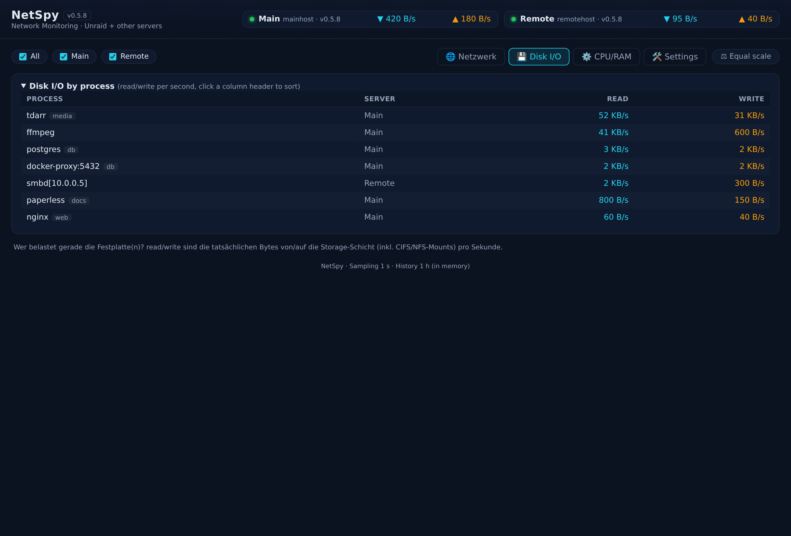

# NetSpy — Live network + disk monitoring for Unraid + other servers

[](https://github.com/thefirstmojo/netspy/actions/workflows/publish-image.yml)

[](https://buymeacoffee.com/thefirstmojo)

Real-time monitoring of your servers in one dashboard: **per-interface, per-process and per-container network throughput**, **disk I/O per process**, **CPU/RAM**, and **latency/health** — 1 s sampling, no database, no `.env` file. **One image, two roles, one compose.**


*Screenshots show synthetic demo data — no real hosts, IPs or containers.*

---

## Features

### 🌐 Network tab
- **Per-process rates** — TCP tracked per socket inode (immune to fork spikes), capped at the physical link rate
- **Interface rates** — total traffic of the default-route interface(s), auto-detected
- **Per-container rows** — bridge containers via read-only Docker socket
- **SMB sessions** — `smbd` rows split per client IP (`smbd[10.0.0.5]`): you see exactly which client is loading a share
- **Connection counts** — active TCP connections per process (e.g. `docker-proxy:6379` → 🔗 47)
- **Detail charts** — click a row for its 1 h history; hover shows the exact values of that moment
- **Server filter chips** — toggle hosts in tables and charts
- **Latency / health** — each server card shows its live poll response time (⏱️ ms badge, green/yellow/red) plus a 5 min latency chart; a hanging agent becomes visible before it drops offline

### 💾 Disk I/O tab
- Read/write per process from `/proc/<pid>/io` — real storage bytes **incl. CIFS/NFS** (SMB transfers show up on the reader)
- EMA-smoothed, sortable by process / server / read / write

### ⚙️ CPU/RAM tab
- CPU% and resident RAM per process, plus per-server host totals
- Display mode switch: **live** (EMA) or **10 s rolling average** (⚡ / 📊 buttons)

### 💾 Storage tab
- Fill levels of the host's **top-level** filesystems/pools (no container-volume subfolders) — compact drive list plus one big line chart per recorded drive: **24 h** (hourly), **7 d** (daily, today live until midnight), **months** (month-end value)
- Recording is **opt-in per drive** (⏺ in the list) — activating a drive creates its chart; nothing is written automatically; data survives restarts (`storage_history.json` in `/netspy/data`)
- Drives that disappear keep their data until you delete it (🗑️ button)

### 🛠️ Settings page
- Add/remove servers in the UI — stored as human-editable `servers.yaml`
- `SERVERS` env entries stay in the env: each row is marked with its origin (env/config) and saving writes only the config rows (edit an env row to move it to the config)
- Works without a volume too (env fallback); the UI explains what to mount

### 🖥️ Terminal tab (SSH via ttyd, web role)
- One persistent terminal **per target, stacked below each other** — connect to several servers at the same time
- Terminals survive tab switches and browser reloads (tmux attach on the target when tmux is installed, plain login shell otherwise)
- Targets are managed under **Settings → 🖥️ SSH Terminal** (stays open): name / host / user, optionally paste an SSH **private key** (stored `0600` in `/netspy/data/ssh`, never sent back to the browser)
- **Passwords are never stored**: without a key, `ssh` asks for the password interactively right in the terminal
- **Login (v0.7.12):** the Terminal tab is locked behind a login form and only unlocks with the **Docker environment variables** `TTYD_USER` + `TTYD_PASS` of the NetSpy container — set them in the container's env (Unraid: **Docker → NetSpy → Edit → Apply**, then **recreate** the container; agents/Portainer: the stack's `environment:` block). They are **not** a NetSpy settings-page option and are never stored in NetSpy — the login form only compares what you type against them. Without both variables set the tab shows a hint instead of a login (terminals stay off); the rest of the dashboard stays open either way. Log in once per browser session; a logout button is in the tab header.
- Each terminal listens on a host port (7681, 7682, …; host networking) and is embedded at `http://<host-ip>:<port>`
- **⚠️ Security: private LAN only.** The login guards the dashboard's terminal tab; the ttyd ports themselves have no login of their own (embedded iframes can't show a Basic-Auth prompt) — so the actual protection of the servers is their **SSH authentication** (interactive password when no key is stored, keys only if you add them explicitly). Do **not** expose the dashboard or ports 7681+ outside your trusted network.



> **⚠️ Requirements:** `network_mode: host` (the sampler needs the host's `/proc` and `ss`) and **root** (host PID namespace, `/proc/<pid>` reads, optional Docker socket — there is no non-root mode). Ports are set via `WEB_PORT`/`AGENT_PORT` — with host networking the value *is* the host port.

---

## Quick start

| You want to… | Do this |
|---|---|
| **Install on Unraid** | It's in the **Unraid Community App Store**: **Apps → NetSpy → Install**. Set `SERVERS` (e.g. `Main=local`) and `AGENT_TOKEN`; everything else has sensible defaults. |
| **Add an agent** (TrueNAS/Debian/…) | Copy `docker-compose.yml` to that host → set `ROLE: agent`, `SERVERS: ""`, `UPLINK` (e.g. `eth0`), same `AGENT_TOKEN`. On **TrueNAS** also uncomment `security_opt: [apparmor:unconfined]` (minimal relaxation, no `privileged`). Deploy via Portainer stack or `docker compose up -d`. |

All settings stay editable later under **Docker → NetSpy → edit**. Pin the image tag (`ghcr.io/thefirstmojo/netspy:vX.Y`) for deterministic updates; with `:latest` tick "Pull latest image" when updating.

## Configuration

All values live directly in `docker-compose.yml` — no `.env` file.

| Key | Default | Description |
|---|---|---|
| `ROLE` | `web` | `web` (UI + sampler) or `agent` (sampler only) |
| `SERVERS` | `Main=local` (optional) | `Name=local;Name=http://host:8091` — semicolon-separated. **Optional:** if unset or empty, a local server (`Main=local`) is added automatically on first start |
| `UPLINK` | auto (default route) | Comma-separated override, e.g. `br0,bond0` |
| `TZ` | `UTC` | Container timezone, e.g. `Europe/Berlin` (v0.7.35+, `tzdata` ships in the image). Decides when the storage history closes its day and month (local midnight instead of 02:00 with UTC) and the zone of all timestamps. Without `tzdata` the variable would be silently ignored — hence it is part of the image |
| `WEB_PORT` / `AGENT_PORT` | `8090` / `8091` | Host ports (host networking — the values ARE the external ports) |
| `AGENT_TOKEN` | empty | Shared `X-Agent-Token` header — **must match on all hosts** |
| `TTYD_USER` | empty | **Terminal tab login — username** (v0.7.12+). Container env var only — never stored in NetSpy, no settings-page option. Set both `TTYD_USER` + `TTYD_PASS` → the Terminal tab shows a login form and unlocks with these credentials |
| `TTYD_PASS` | empty | **Terminal tab login — password** (v0.7.12+). Container env var only — never stored in NetSpy. Both empty (`TTYD_USER` + `TTYD_PASS`) → terminals stay disabled (tab shows a hint); the rest of the dashboard stays open |
| `DOCKER_SOCK` | `/var/run/docker.sock` (web) | Docker socket for per-container rows; `""` disables |
| `CONFIG_DIR` | auto-detected | Volume for `servers.yaml` — `/netspy` mount → `/netspy/config` |

Plus two commented blocks in the compose, enabled per host: **AppArmor** (`security_opt: [apparmor:unconfined]`, hosts that enforce it) and the **Docker socket** volume.

## Architecture

```
Unraid 10.10.10.10                        TrueNAS 10.10.10.20
┌──────────────────────────────┐         ┌─────────────────────────┐
│ netspy (ROLE=web)            │  HTTP   │ netspy (ROLE=agent)     │
│  :8090 Web UI                │◄───────►│  :8091 /api/metrics      │
│  :8091 /api/metrics          │  poll   │  /proc + ss (inet_diag)  │
└──────────────────────────────┘         └─────────────────────────┘
```

The **web instance polls every agent once per second**; agents never initiate connections. An unreachable agent is simply marked offline — the rest keeps working.

## Security

- **Plain HTTP, one shared token** — `AGENT_TOKEN` (as `X-Agent-Token`) is the only access control and does **not** encrypt anything. **LAN / trusted network only**; don't expose ports 8090/8091 without a VPN or TLS reverse proxy. The token is never written to logs.
- **Hardened container:** `cap_drop: [ALL]` with only `SYS_PTRACE` added, Docker socket read-only and off by default.
- **Root is required** — NetSpy reads `/proc` and `ss` of *all* processes (incl. root daemons like smbd): socket attribution, `/proc/<pid>/io`, `/proc/<pid>/stat`. Reading another user's proc files needs root; PUID/PGID 99:100 would silently produce empty lists. There is no non-root mode.

### Config volume — make it writable

The settings page writes `servers.yaml` into the mounted volume. As root **without** `CAP_DAC_OVERRIDE`, the container can only write into world-writable directories — so make the mounted base directory world-writable once (the container creates subfolders `0777` and files `0666` itself, so you can still edit them):

```bash
chmod 777 /mnt/user/appdata/netspy      # Unraid
chmod 777 /opt/netspy                   # other hosts
```

> ⚠️ **Do NOT add `--cap-add=DAC_OVERRIDE`** to fix this — that capability lets the root container bypass **all** file permission checks, including on every other mounted directory. Fix the folder permissions instead.

---

## How it works (short)

- **Interface rates:** `/proc/net/dev` deltas; "total traffic" = the interface(s) with the default route (auto-detected — br0 on Unraid, eth0/bond0 elsewhere).
- **Per-process rates:** `ss -tinpe` per socket inode, deltas aggregated by process, capped at the physical link rate (no impossible artifacts). UDP and kernel traffic (nfsd/kworker) land in the row "**not assigned (kernel/UDP)**".
- **Per-container rates:** bridge containers get their own rows (veth sums → container name). Host-network containers (e.g. `binhex-*`) share the host netns and deliberately get **no badge** (indistinguishable from host processes).
- **Disk I/O:** `/proc/<pid>/io` deltas — storage-layer bytes incl. network filesystems, EMA-smoothed.
- **History:** 1 h ring buffer in the web container's memory (no DB).

**Known limits:** TCP only per process (UDP/kernel → "not assigned") · 1 s sampling averages short bursts.

## Local build (development only)

```bash
docker build -t netspy:latest .   # then use image: netspy:latest in the compose
```

## Tests

Backend tests need nothing but Python (no browser, no services):

```bash
python3 test_backend_units.py   # API payload, polling, storage history, config, terminal targets
python3 app/agent.py --selftest # parser fixtures (ss / route table)
```

DOM tests render the real `app/static` in Chromium (Playwright) and check the
terminal tab, the command list tooltip, the filter chips and the resize/auto-scroll
behaviour — run each script directly: `python3 test_cmdlist.py`,
`test_filter_audit.py`, `test_resize_autoscroll.py`, `test_terminal_suggested.py`.

## Planned

- Persistent history (SQLite/InfluxDB) across restarts
- Threshold alerts (email/Telegram)

---

*Provided "as is", without warranty of any kind. Use at your own risk.*
